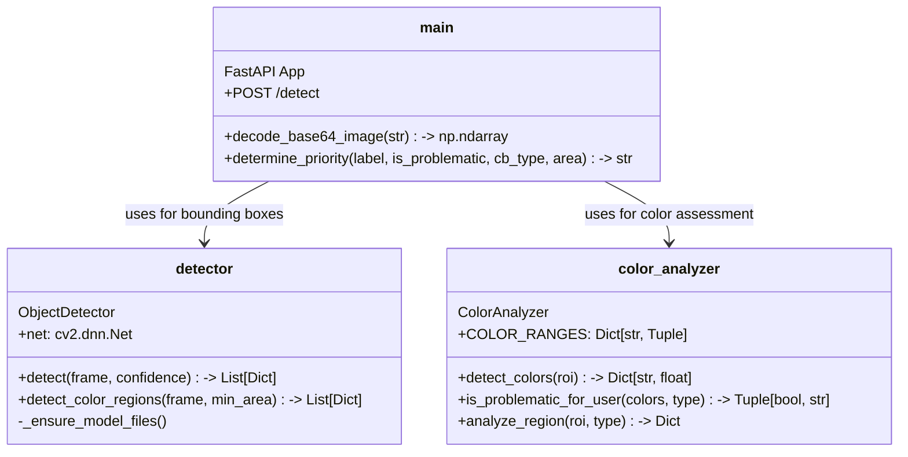
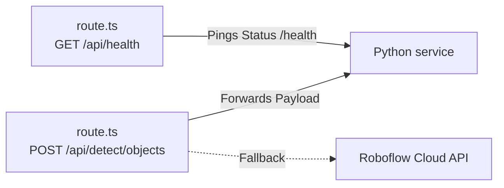
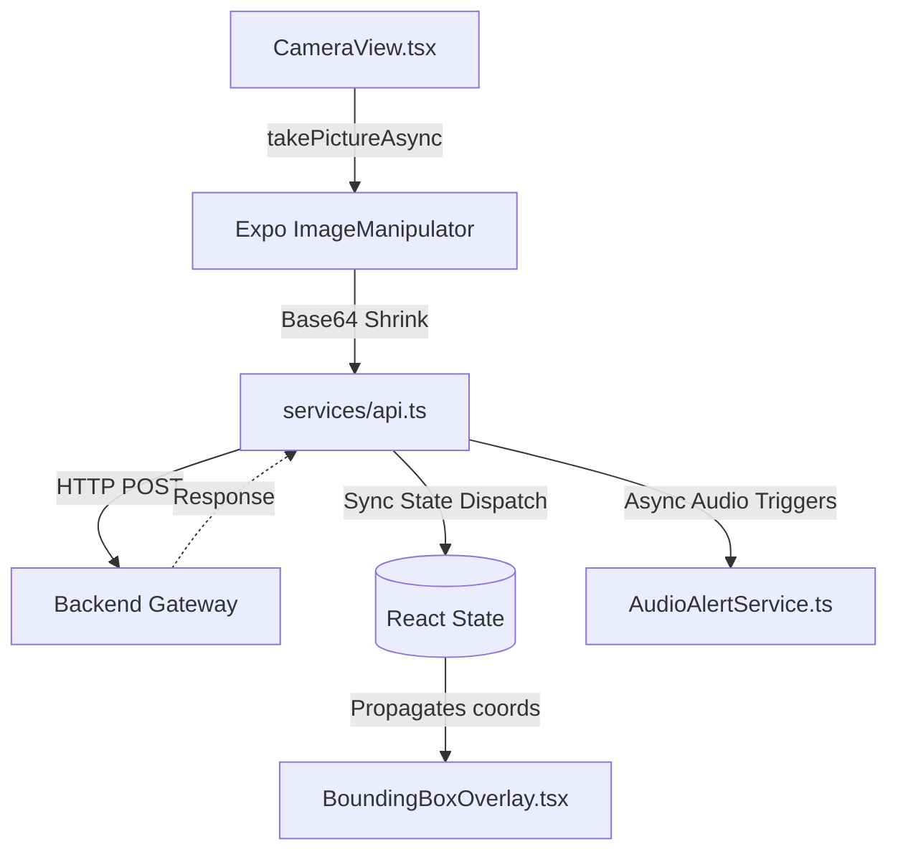
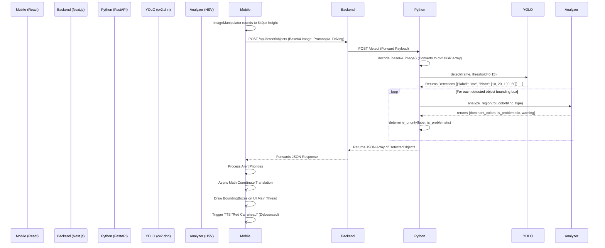

# TrueLight Developer Log: Comprehensive Architecture & Systems Design

This document details the complete technical architecture, data flow heuristics, computer vision logic, React Native state management, backend routing, and deployment strategy of the TrueLight assistive technology project. TrueLight is uniquely engineered to assist colorblind and low-vision users by providing real-time object detection and intelligent, user-specific color analysis combined with spatial proximity awareness.

The system relies on a tripartite architecture designed to strictly separate the concerns of frontend rendering, backend routing, and complex mathematical compute:
1.  **Mobile Interface:** A React Native application for frame capture, local configuration, asynchronous coordinate mathematical translation, and non-blocking audio alert presentation.
2.  **API Gateway:** A Next.js backend proxy routing requests to avoid direct exposure of compute nodes, managing connection resilience, and setting up the infrastructure for future database/authentication integration.
3.  **Computer Vision Microservice:** A Python FastAPI service handling YOLOv3 object detection, OpenCV HSV color isolation matrices, and physical-world prioritization heuristics.

---

## 1. High-Level Architecture

The components communicate primarily via standard HTTP protocols. This microservice architecture ensures loose coupling, which is critical because the computationally expensive vision tasks can be shifted to dedicated AI-hardware (like server-grade GPUs or edge-TPUs) without requiring structural changes to the React Native UI code or Next.js middleware.

The division of labor is strict:
- The **Mobile App** only knows *how to capture and display*.
- The **Backend** only knows *how to route and protect*.
- The **Python Server** handles *what things are and how dangerous they are*.

```mermaid
graph TD
    subgraph Mobile Device (iOS/Android)
        App[React Native App<br/>Expo Managed Workflow]
        Cam[Camera System<br/>expo-camera]
        BBox[Coordinate Translator<br/>BoundingBoxOverlay]
        Audio[TTS Engine<br/>expo-speech]

        App -->|Captures Compressed Frames| Cam
        App -->|Renders SVG Overlays| BBox
        App -->|Fires Asynchronous Voice| Audio
    end

    subgraph Backend Server (Vercel/Node.js)
        API[Next.js API Gateway<br/>Edge Functions]
        HealthPoller[Status Checker]
        Auth[NextAuth/Session state]

        API -.-> Auth
        API -.-> HealthPoller
    end

    subgraph Compute Node (EC2/Localhost)
        Python[Python Microservice<br/>FastAPI]
        YOLO[YOLOv3-tiny<br/>cv2.dnn]
        CV2[OpenCV Color Analyzer<br/>HSV Masks]
        Heuristics[Proximity/Danger Logic]

        Python --> YOLO
        Python --> CV2
        Python --> Heuristics
    end

    App <-->|JSON + Base64 Image (REST)| API
    API <-->|JSON + Base64 Image (REST)| Python
```

---

## 2. Directory Structure and Component Deep-Dive

The project is split into three main directories: `mobile`, `backend`, and `python-detection`.

### 2.1 The Python Detection Microservice (`/python-detection`)

This is the core computational engine of the TrueLight application. While Node.js excels at asynchronous I/O and web requests, Python remains the industry standard for matrix operations and interoperability with C++ vision libraries like OpenCV.

#### Component Breakdown



- **`main.py`**: The entry point. It utilizes Uvicorn as an ASGI server to run FastAPI. When a POST request arrives, it extracts the Base64 string, validates the format, and uses `cv2.imdecode` via a `BytesIO` buffer to generate an OpenCV-compatible NumPy array (in BGR format). Fast in-memory decoding is essential here to keep API latency under 50ms.
    - **Dynamic Sensitivity Configurations**: `main.py` manages different algorithmic constraints based on the `transport_mode` flag sent by the user's phone.
        - *Walking Mode*: Low thresholds (e.g., `confidence > 0.08`, `min_area > 800px`). Assumes the user is moving slowly (3 mph), so catching small, distant objects early is safe and gives them time to react visually.
        - *Driving Mode*: High thresholds (e.g., `confidence > 0.15`, `min_area > 2000px`). When moving fast (60 mph), false positive alerts are distracting and incredibly dangerous. The logic explicitly filters the 80 COCO classes down to only road-relevant items (e.g., ignoring "keyboard" or "vase", keeping "car", "stop sign", "traffic light").
        - *Low Vision Mode*: Completely overrides normal behavior. Discards color dependency and prioritizes entirely by bounding box proximity scaling (see Advanced Heuristics).
- **`detector.py`**: Wraps the OpenCV Deep Neural Network (`cv2.dnn`) module, configured to run `YOLOv3-tiny`.
    - **Why YOLOv3-tiny?**: Full YOLOv8 or YOLOv10 models, while highly accurate, require dedicated GPUs and >1GB of VRAM to hit 30 FPS. `YOLOv3-tiny` is heavily quantized. It sacrifices ~15% mAP (mean Average Precision) accuracy but can run inference on a standard x86 CPU core in under 80ms, making it ideal for a cheap, scalable microservice.
    - **Detection Pipeline**: It scales the image, creates a 416x416 blob (`cv2.dnn.blobFromImage`), runs a forward pass through the neural net, and extrapolates the output tensor into geometric properties.
    - **Non-Maximum Suppression (NMS)**: Because YOLO anchors will often draw 5 overlapping boxes around a single car at different scales, the detector uses `cv2.dnn.NMSBoxes` to suppress overlapping bounding boxes holding lower confidence scores. This prevents the React Native frontend from rendering a mess of conflicting red squares on the screen.
    - **Emergency Fallbacks (`detect_color_regions`)**: If YOLO fails to classify an object (e.g., an extremely strange piece of modern art blocking a sidewalk), it invokes a fallback method utilizing pure HSV masking across the entire frame. This guarantees the user receives visual/audio feedback if undeniably bright, problematic colors are present in the environment (highlighting a large unclassified pink blob and warning them), ensuring physical safety over semantic correctness.
- **`color_analyzer.py`**: Contains the complex multidimensional arrays mapping mathematical HSV values `(Hue, Saturation, Value)` to human-readable strings.
    - **HSV vs RGB Matrices**: HSV (Hue, Saturation, Value) is used instead of RGB because it is far more robust to ambient lighting changes. A shadow might drastically change the RGB value of a red car (making it look "black" to the computer), but the "Hue" degree remains relatively stable during a daytime-to-evening transition.
    - **Problematic Mapping**: It computes pixel percentages for 20+ specific color masks within the bounds of the ROI passed from `main.py` (e.g., `cv2.countNonZero(mask) / total_pixels`). It then cross-references those dominant colors against the `ColorBlindnessType` enum mapping. For example, if a user profile is "Deuteranopia" (green-blind) and a detected traffic light region is >20% green, it flags `is_problematic_color = True`, ensuring the user is alerted to the "Go" signal.

### 2.2 The Backend API Proxy (`/backend`)

The backend serves primarily as a routing, standardization, telemetry, and security layer. By placing a Next.js Edge-compatible server between the wide-open internet and the Python service, we prevent malicious actors from spamming the expensive Deep Learning endpoints directly.

#### Component Breakdown



- **`app/api/detect/objects/route.ts`**: The main transit route. It takes payloads from the mobile app (containing the Base64 image and accessibility contexts) and acts as a reverse proxy, forwarding them locally to the `localhost:8000` Python service.
    - **Resilience & Graceful Degredation**: The Next.js API acts as a shield. If the Python API hangs or returns an `ECONNREFUSED` (because the microservice crashed under heavy video load), Next.js catches the exception and returns a structured `503 Service Unavailable` JSON object to the mobile client holding fallback UI instructions, rather than crashing the primary server stack. This allows the mobile app to show a friendly UX rather than a white screen of death.
    - **Telemetry Processing**: It calculates a `backend_processing_time_ms` differential by diffing `Date.now()` at the boundary of the Python request. This allows developers to trace via logs whether system lag is being introduced by Next.js edge routing (Vercel cold boots) or by Python YOLO inferences.
- **`lib/detection.ts`**: A secondary module integrating the Roboflow Cloud API. This serves as an alternative detection engine specifically tuned for *Traffic Lights only*, acting as a third-party cloud fallback if local compute fails or is overloaded. This was essential during early beta testing when the YOLOv3 model struggled with over-exposed LED traffic lights at night.

### 2.3 The Mobile Application (`/mobile`)

The end-user layer. It handles complex OS-level device APIs, React state synchronization, coordinate math translation, memory profiling, and concurrent text-to-speech.

#### Component Breakdown



- **`app/camera.tsx`** & **`components/CameraView.tsx`**: The view controllers and OS adapters.
    - **Memory Throttling & Resolution Debouncing**: Submitting full-resolution 4k frames natively from an iPhone 15 Pro at 30 FPS would instantly overheat the SoC, crash the Node garbage collector, and DDoS the backend server. The `CameraView` implements interval hooks to stagger `cameraRef.current.takePictureAsync` events. Before Base64 serialization, it leverages `expo-image-manipulator` to aggressively compress and resize the image down to 640x480 pixels.
    - **React Lifecycle Guards**: The component checks `isDetecting` React (`useState`/`useRef`) flags to ensure a new network request is *never* fired until the previous one resolves or physically aborts, preventing memory leaks and infinite loop closures.
- **`services/api.ts`**: The core data orchestration hub for the React Native application.
    - **Network Fetch Operations**: It exports the `detectSignal` function, which binds an `AbortController` to the `fetch` API. It enforces a strict 15-second timeout to prevent locked network threads on bad cellular connections.
    - **Post-Processing & NLP Generation**: It sanitizes the raw JSON array, identifying specific traffic light states (red vs yellow vs green), and generates a concatenated conversational string via `generateAlertMessage()`. This string is heavily based on the python-determined `priority` metrics, ranking `critical` items first (e.g. "Red Stop Sign, Red Car") so the user hears the most important thing before they step into an intersection.
- **`components/BoundingBoxOverlay.tsx`**: The most mathematically complex UI file.
    - **Coordinate Translation Arrays**: The Python API returns relative `(x, y, width, height)` coordinates based on the native resolutions of the downscaled image fed to YOLO (640x480). However, the user's physical screen has different dimensions and aspect ratios (e.g., iPhone 15 Pro Max vs a tiny Android SE).
    - `BoundingBoxOverlay` ingests the incoming coordinates alongside the original `imageWidth`/`imageHeight`, calculates inverse scale factors (`containerWidth / imageWidth`), and creates absolute layout positional styles (`top`, `left`, `width`, `height`) tied to absolute device units (dp). This scalar math ensures the red bounding box physically maps onto the real-time background camera feed perfectly without drifting when the user pans the camera.
- **`services/AudioAlertService.ts`**: Manages Text-to-Speech (TTS) bindings using `expo-speech`. Because TTS takes physical time to "speak" a sentence, the system requires threading concurrency. The visual `BoundingBoxOverlay` updates at roughly 3 FPS, but the `AudioAlertService` relies on debouncing mechanisms and priority queues. If multiple "Red car" alerts come through in half a second, it cancels the previous speech utterance and speaks the newest one, preventing the phone from stuttering or reading a backlog of audio queues 10 seconds after the user has walked past the threat.

---

## 4. The Object Detection Lifecycle

The exact sequence of data flow for a single frame analysis guarantees low latency and prioritized alerting:



### 5. Advanced Heuristics and Edge Cases

#### 5.1 Dynamic Proximity Scaling for Low-Vision
The system recognizes that for users with general "Low Vision" (rather than specific colorblindness like Deuteranopia), the semantic color of an object is irrelevant compared to the actual physical *danger* of the object.
- **Logic Matrix:** In `main.py::determine_priority()`, if the user context is `LOW_VISION`, the algorithmic priority completely abandons color evaluation. Instead, it performs spatial-awareness mathematics by dividing the bounding box area (`w * h`) by the total frame area (`image_width * image_height`).
- **Urgency Generation:** If a bounding box takes up >10% of the screen geometry (`relative_size > 0.10`), it is automatically elevated to a `CRITICAL` alert status. It algorithmically guarantees the object is physically extremely close to the user's camera module (within 1-2 meters), overriding the need for it to be a traditionally "dangerous" object like a car. A bench that is 1 meter away is more dangerous than a car 100 meters away for a blind user.

#### 5.2 Color Isolation Matrices & Lighting Failures
The true intelligence of `color_analyzer.py` lies in its multidimensional HSV arrays. To accurately flag "Red" in the physical world involves two distinct boundaries on the Hue spectrum because the color Red wraps around the 0/180 degree line in the OpenCV color cylinder.
- `"red_low": ((0, 70, 50), (10, 255, 255))`
- `"red_high": ((170, 70, 50), (180, 255, 255))`
The Analyzer runs `cv2.inRange` for both masks and performs a `cv2.bitwise_or` function to merge them. By checking for both "low red" and "high red" independently, the system guarantees that reds aren't dropped in weird lighting conditions (e.g. tungsten street lamps vs harsh fluorescent sunlight), preventing deadly false-negatives during physical navigation in the evening.

---

## 6. Future Expansion & Deployment Roadmap

Currently, the architecture operates synchronously over stateless HTTP `POST` requests. Moving forward, the following architectural upgrades would dramatically increase frame rates, decrease battery overhead, and open the door for AR integration:

1.  **WebRTC Video Streams:** Instead of serializing individual Base64 images to bloated strings and POSTing them over TCP, the mobile client could open a WebRTC UDP tunnel to the Python server, streaming a heavily compressed H.264 video feed natively. Python could sample frames directly from the live video buffer in memory, dropping network overhead latency from ~50ms per frame to ~5ms.
2.  **Edge Compute (CoreML/TFLite):** The YOLOv3-tiny model runs efficiently enough (fewer than 10 million parameters) that we could export the `.weights` file to ONNX/TFLite format and execute it directly on the iOS Neural Engine or Android TPU hardware using NativeModules or React Native Skia. The Next.js and Python backend routing would then be entirely removed. This single change would make the app functional offline, drop latency to zero, and dramatically preserve user privacy by never letting images leave the phone.
3.  **Smart Glasses Integration (AR SDKs):** The React Native codebase is built abstractly. The `BoundingBoxOverlay` components currently map coordinates to a phone screen. By hooking into hardware APIs (like Meta Ray-Bans or Xreal Air AR glasses via native iOS Swift bridges), the camera feed could be captured from the glasses, run through the iPhone's edge-computed YOLO model, and project the SVG bounding box overlays directly into the user's retinas, creating a true, hands-free augmented reality assistive device.
4.  **Dockerization & Cloud Autoscaling:** Assuming edge-compute isn't viable for all devices, the Python microservice must be containerized utilizing `nvidia-docker` to allow for seamless deployment on AWS EC2 `g4dn` instances. This grants the OpenCV DNN module access to real NVIDIA CUDA hardware acceleration tensors instead of relying on slow CPU inference, preparing the pipeline to process 1,000+ concurrent user streams managed by an AWS Auto Scaling Group.
