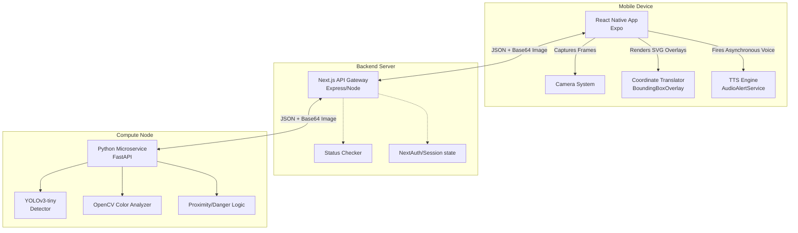
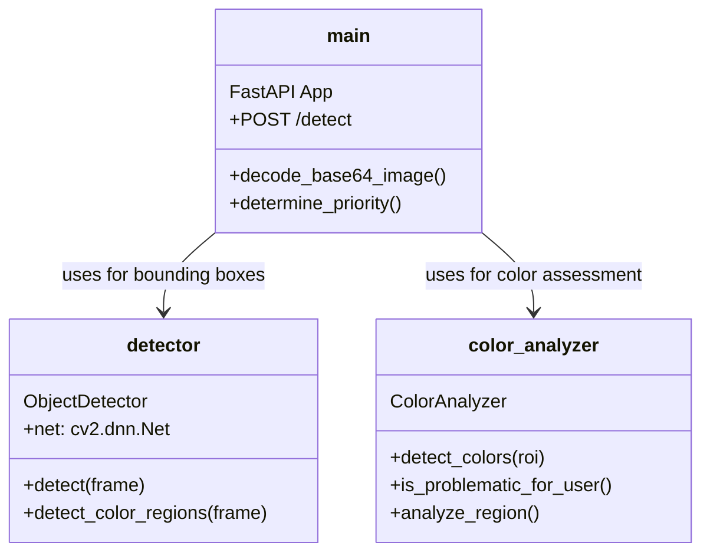
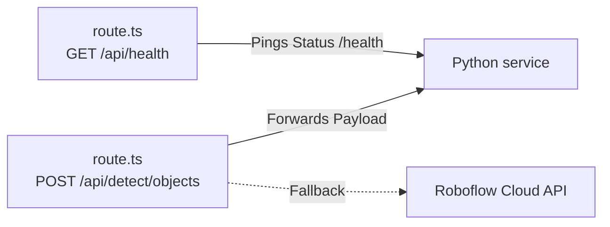
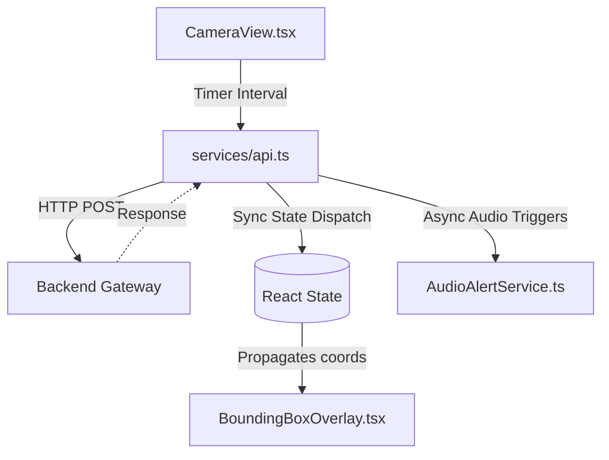
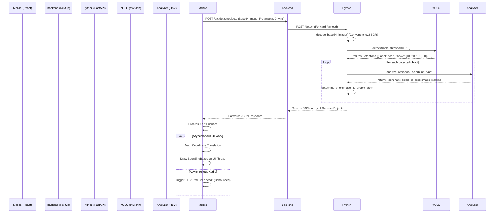

# TrueLight Developer Log: Comprehensive Architecture & Systems Design

This document details the complete technical architecture, data flow heuristics, computer vision logic, React Native state management, and deployment strategy of the TrueLight assistive technology project. TrueLight is designed to assist colorblind and low-vision users by providing real-time object detection and intelligent, user-specific color analysis.

The system relies on a tripartite architecture designed to separate the concerns of frontend rendering, backend routing, and complex mathematical compute:
1.  **Mobile Interface:** A React Native application for capture, local configuration, bounding box translation, and asynchronous audio alert presentation.
2.  **API Gateway:** A Next.js backend proxy routing requests to avoid direct exposure of compute nodes, while setting up the infrastructure for future database integration.
3.  **Computer Vision Microservice:** A Python FastAPI service handling YOLOv3 object detection, OpenCV HSV color analysis, and physical-world prioritization heuristics.

---

## 1. High-Level Architecture

The components communicate primarily via standard HTTP protocols. This microservice architecture ensures loose coupling, which is critical because the computationally expensive vision tasks can be shifted to dedicated AI-hardware (like GPUs) without requiring structural changes to the React Native or Next.js codebases.

The division of labor is strict: the Mobile App only knows *how to display*; the Backend only knows *how to route*; the Python service handles *what things are*.

---

## 2. Directory Structure and Component Deep-Dive

The project is split into three main directories: `mobile`, `backend`, and `python-detection`.

### 2.1 The Python Detection Microservice (`/python-detection`)

This is the core computational engine of the TrueLight application. While Node.js excels at asynchronous I/O, Python remains the industry standard for matrix operations and interoperability with C++ vision libraries like OpenCV.

#### Component Breakdown

- **`main.py`**: The entry point. It sets up the FastAPI server and exposes the primary `/detect` endpoint. When a request arrives, it extracts the Base64 image, decodes it into an OpenCV-compatible NumPy array, and queries the `ObjectDetector`. Afterward, it passes the resulting bounding box Regions of Interest (ROI) to the `ColorAnalyzer` before feeding the combined data into `determine_priority()`.
    - **Dynamic Sensitivity Configurations**: `main.py` manages different configurations based on user transport mode.
        - *Walking Mode*: Low thresholds (e.g., `confidence > 0.08`, `min_area > 800`). Assumes the user is moving slowly, so catching small, distant objects early is safe and gives them time to react.
        - *Driving Mode*: High thresholds (e.g., `confidence > 0.15`, `min_area > 2000`). When moving fast, false positives are annoying and dangerous. It only flags immediate, high-confidence bounding boxes and explicitly excludes non-road-relevant COCO classes (like "keyboard" or "vase").
        - *Low Vision Mode*: Discards color completely and prioritizes entirely by proximity (calculated via bounding box area relative to the total frame area).
- **`detector.py`**: Wraps the OpenCV Deep Neural Network (`cv2.dnn`) module, configured to run `YOLOv3-tiny`.
    - **YOLO Mechanics**: It maintains the 80 COCO class labels. It scales the image, creates a 416x416 blob (`cv2.dnn.blobFromImage`), and runs a forward pass through the neural net.
    - **Non-Maximum Suppression (NMS)**: Because YOLO will often draw 5 overlapping boxes around a single car, the detector uses `cv2.dnn.NMSBoxes` to suppress overlapping bounding boxes holding lower confidence scores. This prevents the React Native frontend from rendering a mess of spaghetti on the screen.
    - **Fallback Heuristics (`detect_color_regions`)**: If YOLO fails to find anything (perhaps due to poor lighting or an object outside the COCO class list), it uses a fallback method utilizing pure HSV masking. This guarantees the user receives *some* visual feedback if dangerous, bright, problematic colors are present in the environment (e.g., highlighting a large unclassified pink blob).
- **`color_analyzer.py`**: Contains the complex definition mapping mathematical HSV values `(Hue, Saturation, Value)` to human-readable strings like "rust orange" or "magenta".
    - **HSV vs RGB**: HSV (Hue, Saturation, Value) is used instead of RGB because it is far more robust to lighting changes. Shadows might drastically change RGB values causing a red car to look "black" to the computer, but the "Hue" remains relatively stable.
    - **Problematic Mapping**: It computes pixel percentages for specific color masks within the bounds of the ROI passed from `main.py`. It calculates if the dominant colors conflict with the `ColorBlindnessType` enum mapping passed dynamically by the user device. For example, if a user is "protanopia" (red-blind) and a detected car region is >10% red, it flags `is_problematic_color = True`.

### 2.2 The Backend API Proxy (`/backend`)

The backend serves primarily as a routing, standardization, and security layer. By placing a Next.js server between the client and the Python service, we prevent malicious actors from spamming the expensive Deep Learning endpoints directly.

#### Component Breakdown

- **`app/api/detect/objects/route.ts`**: The main transit route. It takes payloads from the mobile app (containing the Base64 image and accessibility contexts) and forwards them locally to the `localhost:8000` Python service.
    - **Resilience & Graceful Degredation**: The Next.js API acts to shield the mobile client from computer vision crashes. If the Python API returns an `ECONNREFUSED` because the microservice crashed under heavy video load, Next.js catches the exception and returns a structured 503 JSON object to the mobile client rather than crashing the primary server. This allows the mobile app to show a friendly "Service Unavailable" message instead of white-screening.
    - **Logging Overhead Tracking**: It appends a `backend_processing_time_ms` variable to the returned JSON, allowing developers to trace whether server lag is being introduced by Next.js routing or by Python YOLO inferences.
- **`lib/detection.ts`**: A secondary module integrating the Roboflow API. This serves as an alternative detection engine specifically tuned for *Traffic Lights only*, acting as a third-party cloud fallback if local compute fails or is unavailable. This was essential during early beta testing when the YOLOv3 model struggled with over-exposed traffic LEDs at night.

### 2.3 The Mobile Application (`/mobile`)

The end-user layer. It handles complex device APIs, React state synchronization, coordinate math translation, and concurrent text-to-speech.

#### Component Breakdown

- **`services/api.ts`**: The core data ingestion hub for the React Native application.
    - **Network Orchestration**: It exports the `detectSignal` function, which creates an `AbortController` for network fetches (enforcing a strict 15-second timeout to prevent memory leaks in the app).
    - **Failover Logic**: It attempts to hit the Next.js target (`detectViaBackend`) and will fall back to hitting the Python service directly (`detectWithPython`) if running on a shared local development network.
    - **Post-Processing**: It sanitizes the raw JSON array, identifying traffic light states (red vs yellow vs green), generating a concatenated conversational string via `generateAlertMessage()` based heavily on the python-determined `priority` metrics, ranking `critical` over `low`.
- **`app/camera.tsx`** & **`components/CameraView.tsx`**: The view controllers.
    - **Throttling & Debouncing**: Submitting full-resolution 4k frames at 30 FPS would instantly overheat the iOS/Android device and DDoS the backend server. The `CameraView` implements `setInterval` hooks to stagger `cameraRef.current.takePictureAsync` events, compressing images heavily via base64 before serialization. The component checks `isDetecting` flags to ensure a new network request is *never* fired until the previous one resolves or aborts.
- **`components/BoundingBoxOverlay.tsx`**: The most mathematically complex UI file.
    - **Coordinate Translation Arrays**: The Python API returns relative `(x, y, width, height)` coordinates based on the native resolutions of the image fed to YOLO (which is downscaled). However, the user's physical screen has different dimensions and aspect ratios (e.g., iPhone 15 Pro Max vs a tiny Android).
    - `BoundingBoxOverlay` takes the incoming coordinates and the original `imageWidth`/`imageHeight`, calculates scale factors (`containerWidth / imageWidth`), and creates absolute positional styles (`top`, `left`) tied to absolute device units (dp), ensuring the red bounding box physically maps onto the real-time background camera feed without drifting.
- **`services/AudioAlertService.ts`**: Manages Text-to-Speech (TTS). Because TTS takes time to "speak", the system requires concurrency. The visual `BoundingBoxOverlay` updates at roughly 3 FPS, but the `AudioAlertService` has debouncing mechanisms so it doesn't stutter or overlap sentences if multiple "Red car" alerts come through in half a second.
- **`constants/accessibility.ts` & `constants/colorProfiles.ts`**: Define the global TypeScript interfaces (`ColorblindnessType`, `TransportMode`) ensuring strict typing across the entire repository stack.

---

## 4. The Object Detection Lifecycle

The exact sequence of data flow for a single frame analysis guarantees low latency and prioritized alerting:

### 5. Advanced Heuristics and Edge Cases

#### 5.1 Dynamic Proximity Scaling for Low-Vision
The system recognizes that for users with general "Low Vision" (rather than specific colorblindness), the semantic color of an object is irrelevant compared to the *danger* of the object.
- **Logic:** In `main.py::determine_priority()`, if the user context is `LOW_VISION`, the algorithmic priority completely abandons color metrics. Instead it calculates bounding box area (`w * h`) divided by the total frame area.
- **Urgency Generation:** If a bounding box takes up >10% of the screen geometry, it is automatically elevated to a `CRITICAL` alert queue because it algorithmically guarantees the object is physically extremely close to the user's camera, overriding the need for it to be traditionally "dangerous".

#### 5.2 Color Isolation Matrices
The true intelligence of `color_analyzer.py` lies in its multidimensional HSV arrays. To accurately flag "Red" in the physical world involves two distinct boundaries on the Hue spectrum because Red wraps around the 0/180 degree line in OpenCV.
- `"red_low": ((0, 70, 50), (10, 255, 255))`
- `"red_high": ((170, 70, 50), (180, 255, 255))`
The Analyzer runs `cv2.inRange` for both masks and performs a `bitwise_or` to guarantee reds aren't dropped in weird lighting conditions, preventing false-negatives during physical navigation in the evening or harsh daylight.

---

## 6. Future Expansion & Deployment Strategy

Currently, the architecture operates synchronously over HTTP `POST` requests. Moving forward, the following architectural upgrades would dramatically increase frame rates and battery efficiency:

1.  **WebRTC Video Streams:** Instead of serializing individual Base64 images to strings and POSTing them, the mobile client could open a WebRTC tunnel to the Python server, heavily compressing an H.264 video feed. Python could sample frames directly from the live video buffer, dropping network serialization overhead from ~50ms per frame to ~5ms.
2.  **Edge Compute (CoreML/TFLite):** The YOLOv3-tiny model runs efficiently enough that we could export it to ONNX/TFLite and execute it directly on the iOS/Android hardware using NativeModules or React Native Skia. The Python backend would then be entirely removed, making the app functional offline and dramatically preserving user privacy.
3.  **Dockerization & Cloud Autoscaling:** The Python microservice should be containerized using `nvidia-docker` to allow for seamless deployment on AWS EC2 `g4dn` instances. This grants the OpenCV DNN access to real NVIDIA CUDA hardware acceleration instead of relying on CPU inference, which can struggle to process 10+ concurrent users without autoscaling groups.
